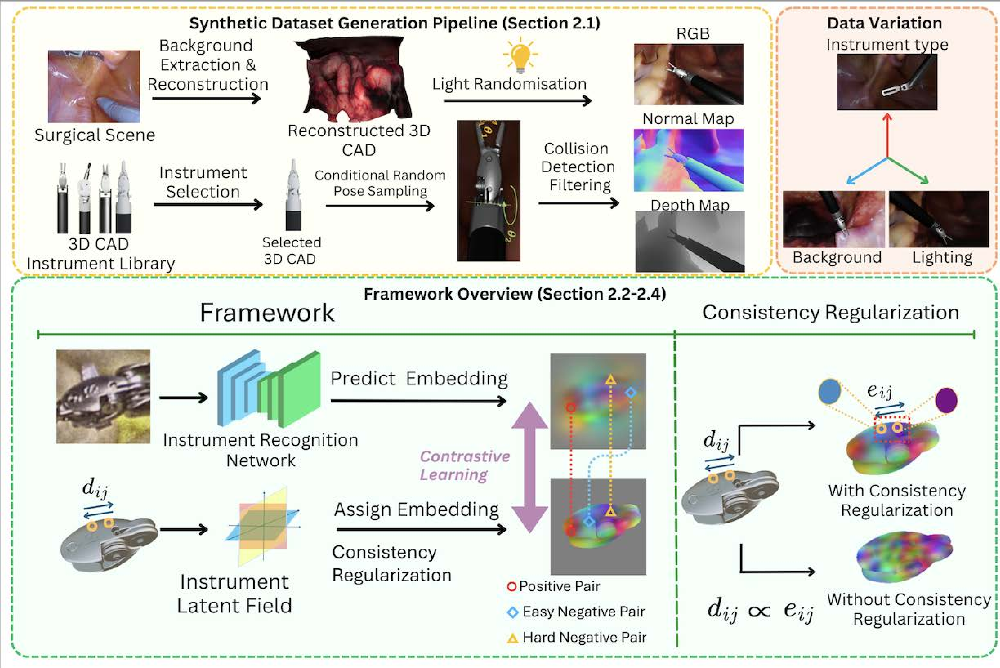
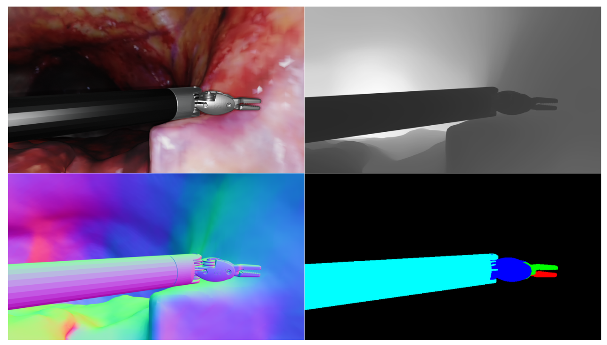
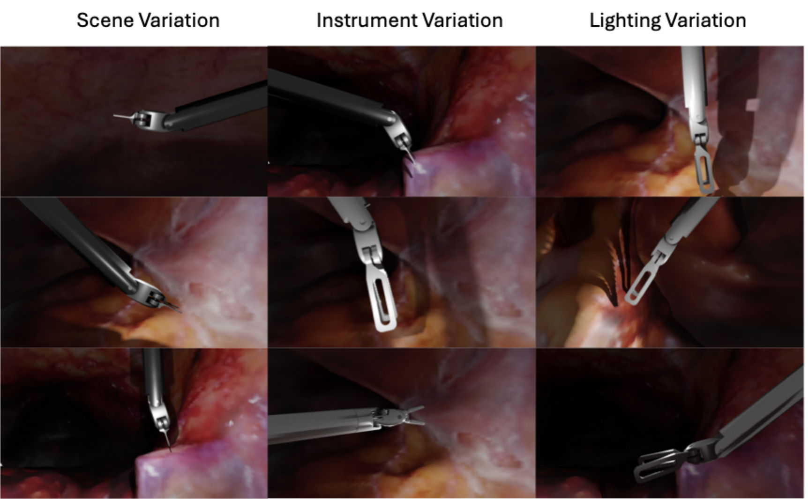
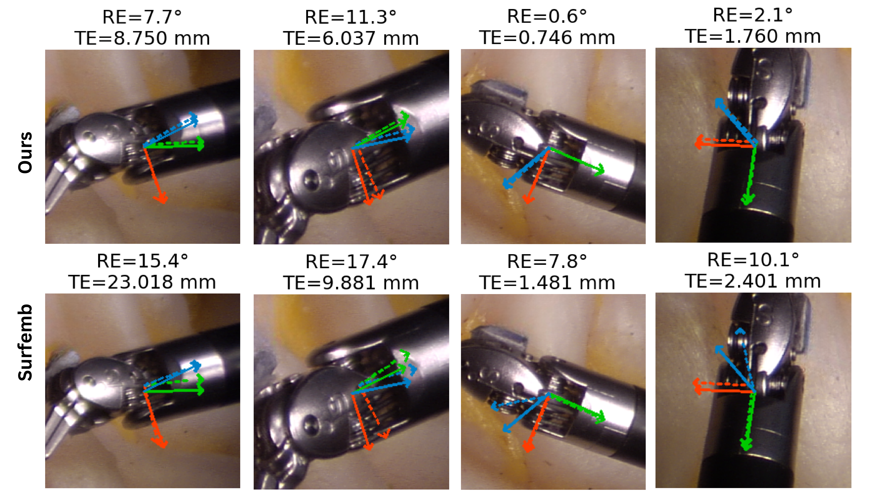
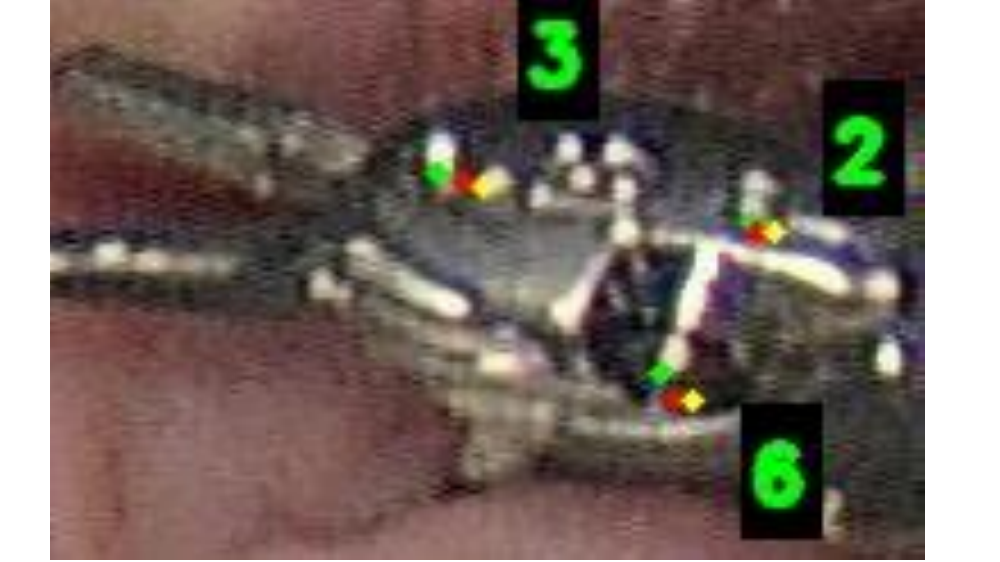

# **[IEEE Robotics and Automation Letters 2026] SurfSurg6D: Geometry Consistent Dense Correspondence for Textureless Surgical Instrument Pose Estimation**

_Daiyun Shen, Shuojue Yang, Chang Han Low, Qian Li, Mengya Xu, Qi Dou, Yueming Jin_

[]()

 **Accepted by IEEE Robotics and Automation Letters (RA-L), 2026**  
 Project page / code: https://github.com/StackingDataYeti/SurfSurg6D  
 Code and dataset will be released at the project repository.

---

##  Overview



Surgical instrument pose estimation is important for robotic minimally invasive surgery, including autonomous robotic surgery, skill assessment, motion control, and surgical workflow standardization. However, reliable 6-DoF pose estimation remains challenging because surgical instruments are often textureless, reflective, partially occluded, and difficult to annotate with accurate 3D pose labels in real operating scenes.

**SurfSurg6D** addresses these challenges with a dense correspondence-based pose estimation framework tailored for surgical instruments. The method learns pixel-to-surface correspondences between RGB observations and instrument CAD surfaces, then estimates 6-DoF pose through correspondence matching and geometric pose solving.

The work also introduces **SynSurg6D**, a synthetic surgical instrument dataset generated from reconstructed surgical scenes and realistic instrument configurations.

### Key Features

- **Dense Surface Correspondence** – Learns correspondences between image pixels and 3D points on surgical instrument surfaces.
- **Instrument Latent Field** – Encodes normalized 3D surface coordinates into geometry-aware embeddings.
- **Image Recognition Network** – Predicts dense per-pixel embeddings from RGB image crops.
- **Distance-Aware Hard Negative Mining** – Emphasizes confusing but geometrically different surface points during contrastive learning.
- **Localized Correspondence Consistency** – Regularizes the implicit embedding field to respect local 3D geometry and reduce surface folding.
- **Synthetic-to-Real Training** – Uses SynSurg6D together with real data to improve pose estimation robustness and generalization.
- **RGB-Only Inference** – Estimates pose from RGB images without requiring depth at test time.

---

##  SynSurg6D Dataset



We introduce **SynSurg6D**, a synthetic dataset designed to alleviate the shortage of accurately annotated surgical instrument pose data.

### Dataset Properties

- **60K synthetic RGB-D images**
- **6 surgical instruments**
- **6-DoF pose annotations**
- **Segmentation maps**
- **Depth maps**
- **Normal maps**
- **Realistic reconstructed surgical backgrounds**
- **Randomized lighting and scene variation**

### Instrument Library

SynSurg6D contains six robotic surgical instruments:

1. Large Needle Driver
2. Scissors
3. Small Clip Applier
4. Cadiere Forceps
5. Biopsy Forceps
6. Permanent Cautery Spatula

### Realistic Surgical Configuration Constraints

To make the synthetic data closer to real robotic surgery, the rendering pipeline applies surgical configuration constraints, including:

- **Remote-center-of-motion (RCM) constraint**, requiring the instrument shaft to pass through a fixed trocar point.
- **Tool-tip depth constraint**, keeping the tip within a 30–100 mm depth range from the local tissue surface.
- **Articulated wrist modeling**, where distal wrist and clip angles are sampled according to surgical instrument kinematic structure.
- **Visibility filtering**, rejecting samples where the instrument leaves the field of view or the wrist visibility is too low.
- **Collision checking**, avoiding physically implausible instrument-scene configurations.
- **Lighting and background randomization**, increasing visual diversity and reducing overfitting.



---

## Method


SurfSurg6D follows a correspondence-based formulation. Given an RGB crop of a surgical instrument, the framework predicts dense image embeddings and matches them with 3D surface embeddings from the instrument model.


##  Experimental Evaluation

SurfSurg6D is evaluated on three surgical benchmark datasets:

- **SurgRIPE** – Real surgical instrument pose estimation with 6-DoF pose annotations.
- **EndoVis2018** – Real surgical scenes with instrument segmentation masks.
- **SurgPose** – Surgical instrument keypoint annotations for 2D projection evaluation.

### Metrics

For 6-DoF pose estimation on SurgRIPE:

- **Rotation Error (RE)**
- **Translation Error (TE)**
- **ADD-10 Accuracy**
- **Average Accuracy from 0–5 mm**

For 2D projection evaluation:

- **Dice score** on EndoVis2018
- **mAP over OKS** on SurgPose

### Main Findings

- SynSurg6D consistently improves multiple pose estimation methods when combined with real training data.
- SurfSurg6D achieves robust pose estimation under occlusion and reflection.
- Compared with Surfemb, SurfSurg6D improves ADD-10 accuracy on SurgRIPE by introducing hard negative mining and consistency regularization.
- On EndoVis2018 and SurgPose, SynSurg6D improves generalization to real surgical scenes.

## Case Studies



The supplementary video demonstrates SurfSurg6D under challenging real surgical conditions, including serious occlusion and strong reflection. Compared with Surfemb and FoundPose, SurfSurg6D shows more stable and robust pose estimation in these difficult frames.



---

We provide a simple demo for the SurfSurg6D performance. It illustrates that our methods can be more robust for occlusion scenes.


---

##  Dataset Format

SynSurg6D is organized in a BOP-style format containing:

```text
|──dataset_root/
|  ├── rgb/
|  │   ├── 000000.png
|  │   ├── 000001.png
|  │   └── ...
|  ├── depth/
|  │   ├── 000000.png
|  │   ├── 000001.png
|  │   └── ...
|  ├── mask/
|  │   ├── 000000.png
|  │   ├── 000001.png
|  │   └── ...
|  ├── mask_visib/
|  │   ├── 000000_000000.png
|  │   ├── 000000_000001.png
|  │   └── ...
|  ├── normal/
|  │   ├── 000000.png
|  │   ├── 000001.png
|  │   └── ...
|  ├── scene_camera.json
|  ├── scene_gt.json
|  ├── scene_gt_info.json
|──models/
|  ├── 000000.ply   
|
```

The essential inputs for pose training and evaluation are:

- RGB images
- Camera intrinsics
- Instrument CAD models
- 6-DoF pose annotations
- Object masks or bounding boxes
- Optional depth / normal / segmentation modalities for synthetic data analysis

---

##  Citation

If you find this work useful, please cite our paper:

```bibtex
@ARTICLE{SurfSurg6D2026,
  author={Shen, Daiyun and Yang, Shuojue and Low, Chang Han and Li, Qian and Xu, Mengya and Dou, Qi and Jin, Yueming},
  journal={IEEE Robotics and Automation Letters},
  title={SurfSurg6D: Geometry Consistent Dense Correspondence for Textureless Surgical Instrument Pose Estimation},
  year={2026},
  pages={1-8},
  keywords={Pose estimation; Surgical scene synthesis; Surgical robotics; Contrastive learning; Data generation},
}
```

---

## Acknowledgement
This work was supported by Ministry of Education Tier 2 grant, Singapore (T2EP20224-0028), and Ministry of Education Tier 1 grant, Singapore (23-0651-P0001).

